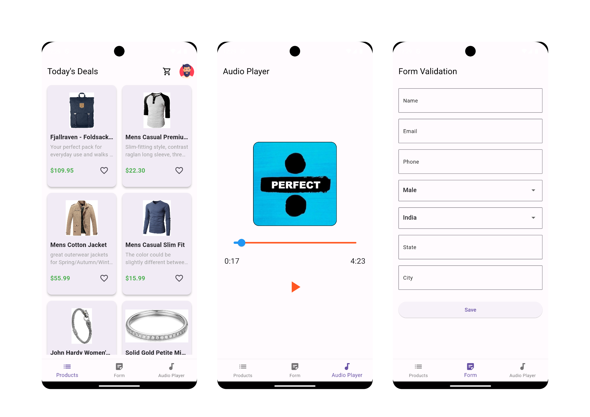

# Audio
This project contains three flavour of Audio, Api call for products, and form page in this project tried to maintain the flavor of clean architecture in some parts


#### Screenshots




## Features

- API call
- Audio Player using state management (Bloc)
- Form fields 
- bottom Navigation
- DI by using get_it

## API Reference

#### Get all items

```http
  GET https://fakestoreapi.com/products
```


